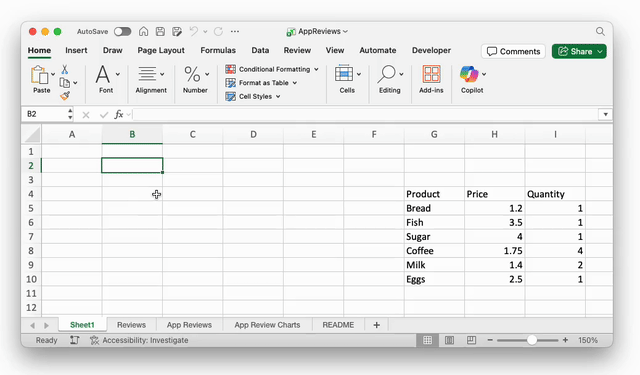

# Excel Ollama Integration

An Excel Workbook that connects to a local [Ollama](https://ollama.com) installation, enabling you to use AI large language models directly in your spreadsheets. Using Ollama means everything can be done locally with no risk of running over Copilot usage limits, or incurring API charges.



## Features

- **Simple LLM Integration**: Call Ollama models directly from Excel formulas
- **Intelligent Caching**: Responses are cached locally to avoid redundant API calls and improve performance
- **Range Analysis**: Pass Excel ranges directly to the model for data analysis
- **Flexible Model Selection**: Use any locally installed Ollama model (defaults to llama3)
- **Mac & Windows Compatible**: Works on both platforms with automatic path detection
- **Error Handling**: Graceful error handling with informative messages

## Why is the workbook called AppReviews.xlsm?

This demo workbook contains two sample datasets: one with hotel reviews and another with app reviews. It automatically calculates [Net Promoter Scores](https://en.wikipedia.org/wiki/Net_promoter_score) (NPS) for accommodation, cleanliness, and value-for-money based on the hotel feedback. It also generates charts illustrating the NPS for speed, functionality, and stability derived from the app reviews.

The first time you edit the reviews in the tables, it will be a little slow because Excel will run all of the cell-prompts for the first time. The results will be cached after that.

## Functions

### `OLLAMA(prompt, [range], [model])`
Main function to interact with Ollama models.

**Parameters:**
- `prompt` (required): Your question or instruction
- `range` (optional): Excel range to include in the analysis
- `model` (optional): Model name (default: "llama3")

**Examples:**
```excel
=OLLAMA("Summarize this in 3 words", A1:A10)
=OLLAMA("What is the capital of France?")
=OLLAMA("Explain quantum computing", , "llama2")
=OLLAMA("Translate to Spanish: Hello", A1, "mistral")
```

### `ClearOllamaCache()`
VBA macro to clear the local response cache.

## Requirements

- Microsoft Excel (Mac or Windows)
- [Ollama](https://ollama.com) installed and running locally
- [VBA-Web](https://github.com/VBA-tools/VBA-Web) library for REST API calls

## Installation

1. Install Ollama from ollama.com
2. Pull your desired model (llama3 is the one this workbook uses by default): ollama pull llama3
3. EITHER install [VBA-Web](https://github.com/VBA-tools/VBA-Web) and import Module1 from this workbook into your workbook, OR…
4. …just copy and edit this workbook to do what you want
5. If you access Ollama from a different machine, edit the `Client.BaseUrl` in the OLLAMA function in Module1
6. Start using the functions in your spreadsheets!

## How It Works

- Makes HTTP POST requests to Ollama's local API (http://localhost:11434)
- Caches responses in `~/Documents/OllamaCache.txt` to avoid repeat calls (it's in `"~/Library/Continers/Microsoft Excel/Data/Documents/OllamaCache.txt"` on the Mac)
- Only caches successful responses (errors trigger fresh API calls)
- Converts Excel ranges to CSV format for model processing
